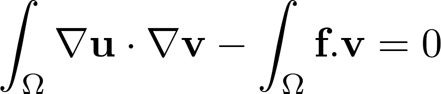

# SECTION
Academic

# TITLE
Laplacian

# DESCRIPTION
Algorithms for solving the 2D and 3D Laplace equation

## Variationnal form

## Example
In this parameter set, a Laplacian porblem is solved on a square with a source term

# 2D
## Files
Laplacian_2D.edp

Results/Result_2D.vtu

## Parameters
f - External force

# 3D
## Files
Laplacian_3D.edp

Results/Result_3D.vtu

## Parameters
f - External force
