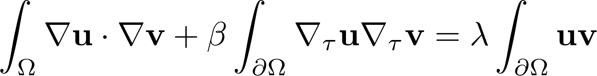

# SECTION
Academic

# TITLE
EigenValue

# DESCRIPTION
Computation of Steklov or Wentzell eigenvalues

uses radial representation for the shape in terms of Fourier coefficients

parametrization uses a vector of the form

vec = [a0, as, bs] where as are coefficients of cos and bs coefficients of sin

## Variational form for the Wentzell problem

# References

B. Bogosel, The method of fundamental solutions applied to boundary eigenvalue problems, 2016, Journal of Computational and Applied Mathematics
