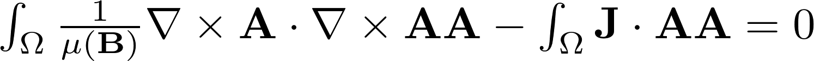

# SECTION
Electromagnetism

# TITLE
Linear_Magnetostatic

# DESCRIPTION
Algorithms for solving the 2D and 3D linear magnetostatic equations

## Variationnal form

## Example
In this parameter set, the magnetic induction is simualted for a magnet crossed by a current

# 2D
## Files
Linear_Magetostatic_2D.edp

Results/Result_2D.vtu

## Parameters
Mu0 - Vacuum magnetic permeability

MuC - Copper magnetic permeability

J0  - Current density

# 3D
## Files
Linear_Magnetostatic_3D.edp

Results/Result_3D.vtu

## Parameters
Mu0 - Vacuum magnetic permeability

MuC - Copper magnetic permeability

J0  - Current density

# References

[MEEKER, David. Finite element method magnetics. 2015.](http://www.femm.info/Archives/doc/manual42.pdf)

