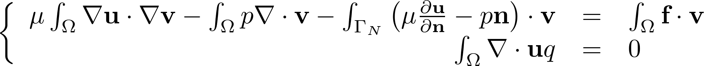

# SECTION
Fluid

# TITLE
Static_Stokes

# DESCRIPTION
Algorithms for solving the 2D and 3D static Stokes equations

## Variationnal form

## Example
In this parameter set, a flow in a pipe is solved using the Stokes equations

# 2D
## Files
Static_Stokes_2D.edp

Results/Result_2D.vtu

## Parameters
uMax - Max imput velocity

Nu   - Viscosity

### Optionnal
F    - External force

# 3D
## Files
Static_Stokes_3D.edp

Results/Result_3D.vtu

## Parameters
uMax - Max input velocity

Nu - Viscosity

### Optionnal
F  - External force

