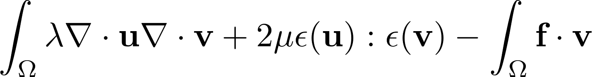
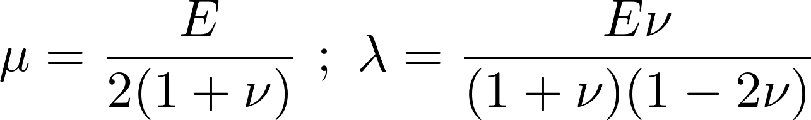

# SECTION
Solid

# TITLE
Static_Linear_Elasticity

# DESCRIPTION
Algorithms for solving the 2D and 3D static linear elasticity equations

## Variationnal form

with

## Example
In this parameter set, a beam is fixed at both ends and undergoes a gravity force

# 2D
## Files
Static_Linear_Elasticity_2D.edp

Results/Result_2D.vtu

## Parameters
Rho   - Density

E     - Young's modulus

Nu    - Poisson's ratio

### Optionnal
Gravity - Gravity

# 3D
## Files
Static_Linear_Elasticity_3D.edp

Static_Linear_Elasticity_3D.geo - Static_Linear_Elasticity_3D.msh

Results/Result_3D.vtu

## Parameters
Rho   - Density

E     - Young's modulus

Nu    - Poisson's ratio

### Optionnal
Gravity - Gravity

