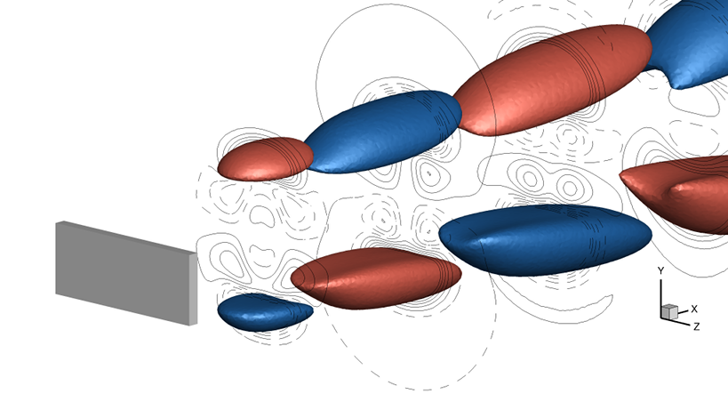

# Augmented Lagrangian Preconditioner for Large-Scale Hydrodynamic Stability Analysis

> A parallel implementation of the steady Navier–Stokes and eigenvalue solvers, developed in the FreeFem++ language, suitably interfaced with the PETSc/SLEPc libraries.



The code available in this repository can reproduce the results from the following paper.
```
@article{moulin2019al,
    Author = {Moulin, Johann and Jolivet, Pierre and Marquet, Olivier},
    Title = {Augmented Lagrangian Preconditioner for Large-Scale Hydrodynamic Stability Analysis},
    Year = {2019},
    Pages = {submitted for publication},
    Journal = {Computer Methods in Applied Mechanics and Engineering},
    Publisher = {Elsevier},
    Url = {https://github.com/prj-/moulin2019al},
}
```

## Getting started
### Dependencies
Make sure you have access to a recent [FreeFem++](https://freefem.org/) installation from the _develop_ branch, compiled with the `PETSc` and `PETSc-complex` **(with SLEPc)** plugins. More details about the [PETSc](https://www.mcs.anl.gov/petsc/petsc-current/docs/manual.pdf) and [SLEPc](http://slepc.upv.es/documentation/slepc.pdf) options used in the solvers may be found in their respective manual.
### Usage example
A small mesh is provided in the `Mesh` folder. One should be able to launch the following command, which solves the steady Navier–Stokes equations for a Reynolds number of 50 (`-Re 50`) on the same geometrical configuration as in the paper.
```
$ mpirun -np 4 FreeFem++-mpi Nonlinear-solver.edp -Re 50 -ns -v 0
```
The set of options `-ns -v 0` is here to minimize the output generated by FreeFem++, see this [tutorial](http://jolivet.perso.enseeiht.fr/FreeFem-tutorial/index.html#pf1c) for more information. Then, for performing the actual linear stability analysis.
```
$ mpirun -np 4 FreeFem++-mpi Eigensolver.edp -ns -v 0
```
The results are stored in the `State/EV` folder.
### Customization
Here are the main command line parameters.

* `Nonlinear-solver.edp`
    1. `-Newton_tol` (default to `1.0e-6`), stopping criterion of the Newton method
    2. `-Newton_max_it` (default to `50`), maximum number of Newton iterations
    3. `-mesh` (default to `FlatPlate3D.mesh`), must be stored in the `Mesh` folder. If changed, do not forget to set the appropriate Dirichlet boundary conditions in the FreeFem++ variational formulations `vJ` and `vRes`.
    4. `-Re` (default to `100`), Reynolds number
    5. `-gamma` (default to `0.1`), augmentation parameter
* `Eigensolver.edp`
    1. `-shift_real` (default to `1.0e-6`), real part of the shift
    2. `-shift_imag` (default to `0.6`), imaginary part of the shift
    3. `-nev` (default to `5`), desired number of computed eigenmodes
    4. `-recycle` (default to `0`), number of recycled vectors from the Arnoldi basis between each GMRES cycle

## Acknowledgements
* European Research Council ([ERC](https://erc.europa.eu/)), project [AEROFLEX](https://w3.onera.fr/erc-aeroflex/home), grant number 638307
* HPC resources of [TGCC@CEA](http://www-hpc.cea.fr/index-en.htm) under the allocation A0030607519 made by [GENCI](http://www.genci.fr/en)
